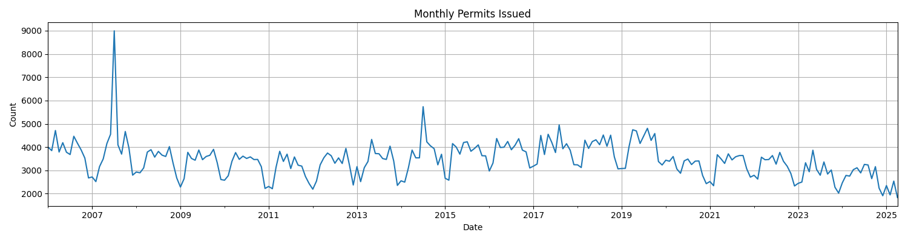
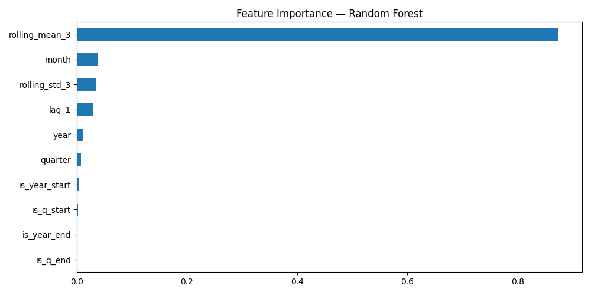
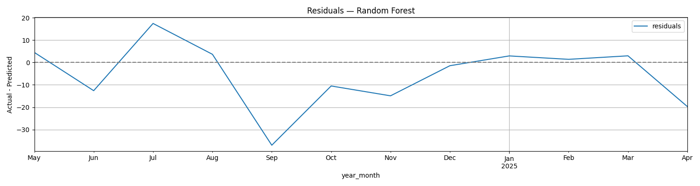
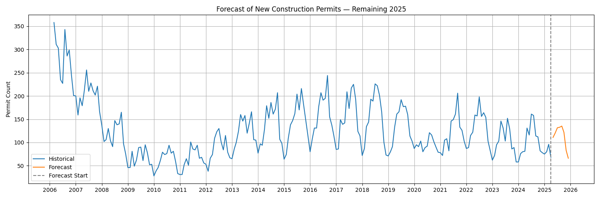

# Forecasting Monthly New Construction Permits in Chicago

## 1. Project Rationale

As part of my current role as a **Real Estate Investment Analyst** for a Swiss investment firm, I work on office development strategies across **Lisbon, Madrid, and London**. One of our recurring challenges is identifying the right acquisition timing based on early signals of local market dynamics.

Among these signals, **construction permit issuance** is a highly valuable indicator. While we usually rely on brokers to obtain this data on a one-off basis, I wanted to explore whether it's possible to go further and build a model that could **anticipate future construction trends**, providing a proactive edge to the investment process.

After researching data availability across multiple markets (including Paris, Seattle, and NYC), **Chicago emerged as the city with the most complete and extensive building permit dataset** publicly available. That made it the ideal ground for developing a robust time series forecasting pipeline.

---

## 2. Objective

Build and evaluate machine learning models to forecast the **monthly number of "new construction" building permits** in Chicago, and generate interpretable predictions for the coming months.

---

## 3. Dataset Overview

- Source: City of Chicago Open Data Portal  
- Records: 2006 → 2025 (~1M total permits, ~30k for new construction)
- Selected Target: `PERMIT - NEW CONSTRUCTION`
- Date Field: `ISSUE_DATE`

---

## 4. Analytical Pipeline

### Data Preparation
- Filtering to new construction only
- Monthly aggregation of permit counts
- Creation of lag, rolling, and calendar-based features

> 📁 Output: `data/processed/monthly_features.csv`

### Exploratory Visualization
```python
plt.plot(df["year_month"], df["permit_count"])
plt.title("Monthly Permits Issued")
```


### Feature Engineering
```python
monthly["rolling_mean_3"] = monthly["permit_count"].rolling(3).mean()
monthly["lag_1"] = monthly["permit_count"].shift(1)
monthly["month"] = monthly["year_month"].dt.month
```

### Modeling
Three models were tested:

| Model           | MAE   | RMSE  |
|----------------|-------|-------|
| Random Forest  | 10.75 | 14.74 |
| XGBoost        | 11.93 | 15.51 |
| Prophet        | 13.93 | 16.85 |

> Final model selected: **RandomForestRegressor** for best accuracy and explainability.

### Model Interpretation
**Feature importance**:
```python
feat_importances.plot(kind="barh")
```


**Residual analysis**:
```python
plt.plot(test["year_month"], test["residuals"])
```


### Forecasting 2025 (with Prophet)
To visualize a realistic forward-looking forecast, Prophet was used to generate predictions from May → December 2025.

```python
plt.plot(df_prophet["ds"], df_prophet["y"], label="Historical")
plt.plot(forecast_future["ds"], forecast_future["yhat"], label="Forecast")
```


---

## 5. Quickstart Guide

### Requirements
```bash
pip install -r requirements.txt
```

### Run notebooks in order:
```text
notebooks/
├── 01_data_exploration.ipynb
├── 02_feature_engineering.ipynb
└── 03_model_training.ipynb
```

### Predict future months (optional)
You can extend predictions to future months by rerunning the Prophet cell in `03_model_training.ipynb`.

---

## 6. Repository Structure
```
chicago-construction-ts-modeling/
├── data/
│   ├── raw/                 # Original CSV
│   └── processed/            # Cleaned & aggregated
├── notebooks/             # All Jupyter steps
├── visuals/               # Plots & exportable assets
├── requirements.txt
└── README.md
```

---

## 7. Next Steps
- Apply this pipeline to **European cities** if similar data becomes available
- Build a simple **Streamlit dashboard** for real-time predictions
- Expand to classify permit types and model spatial distributions

---

## 8. About Me
This project was developed by **Sacha Brouck**, a data-driven real estate analyst preparing to join the **University of Washington MSBA program**. My goal is to create professional, rigorous, and interpretable machine learning projects rooted in real-world investment use cases.

**LinkedIn**: [Sacha Brouck](https://www.linkedin.com/in/sacha-brouck/)  
**GitHub**: [SBrouck](https://github.com/SBrouck)

